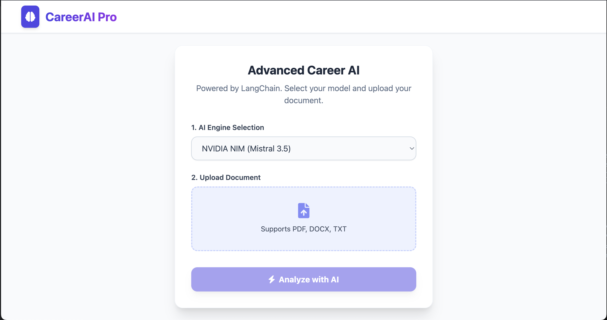
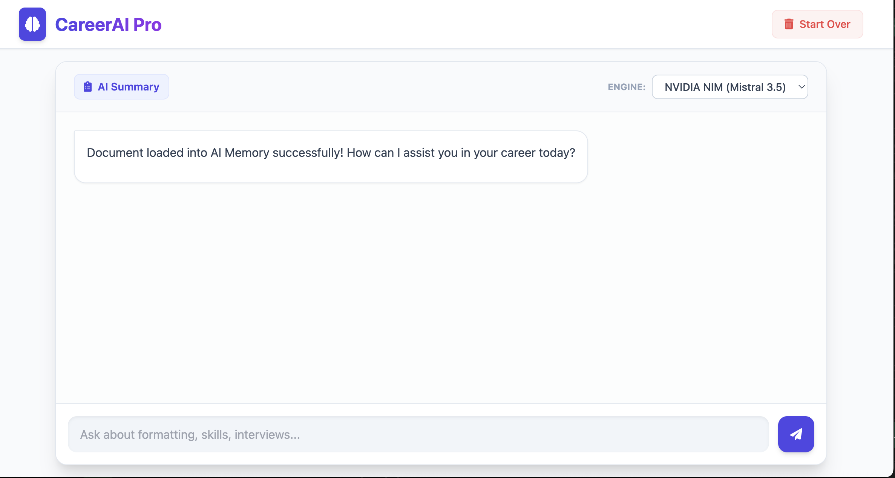

 _🚀 CareerAI Pro: Enterprise AI Career Advisor

**CareerAI Pro** is a high-performance, modular AI platform designed to transform raw resumes into actionable career insights. Built with **LangChain**, **Flask**, and **Data Science** libraries, it features a multi-LLM engine (OpenAI, Gemini, NVIDIA NIM, OpenRouter) and an automated **ATS Scoring** system with visual radar analytics.

---


## 🚀 Features Preview

|                      Home Page                       | Chat & Analytics UI |
|:----------------------------------------------------:| :---: |
|  |  |

##_ 🛠️ Key Features

*   **Multi-Model Intelligence:** Switch between OpenAI, Google Gemini 2.0, NVIDIA NIM, and OpenRouter (Llama 3.3) on the fly.
*   **ATS Compatibility Scoring:** Uses **Scikit-Learn** and **TF-IDF** algorithms to calculate how well your resume matches enterprise software roles.
*   **Visual Skill Matrix:** Generates dynamic radar charts using **Matplotlib** and **Seaborn** to visualize technical proficiency.
*   **Multi-Format Parsing:** Support for `.pdf`, `.docx`, and `.txt` files.
*   **Enterprise Memory:** Implements server-side sessions to handle heavy data without breaking browser cookie limits.
*   **Modern UI:** A sleek, responsive dashboard built with **Tailwind CSS 4.0** and dark-mode glassmorphism.

---

## 📂 Project Structure
```text
career_ai_pro/
├── services/
│   ├── ai_service.py        # LLM Orchestration
│   ├── analytics_service.py # ATS Scoring & Radar Charts
│   ├── chat_manager.py      # Memory & Prompt Templates
│   └── document_service.py  # PDF/Docx Extraction
├── providers/               # AI Model Wrappers
├── static/
│   ├── js/main.js           # Frontend Logic
│   └── css/styles.css       # Custom Animations
├── templates/
│   └── index.html           # Dashboard UI
├── app.py                   # Flask Enterprise Gateway
├── config.py                # Environment Management
├── install.py               # Automated Setup Script
└── requirements.txt         # Dependency Manifest

Quick Start
1. Prerequisites
Python 3.11 or 3.12 (Recommended for AI stability).

Homebrew (For Mac users).

2. Installation
Clone the repository and run the automated installer:

Bash
# Create a virtual environment
python3 -m venv venv
source venv/bin/activate

# Install all enterprise dependencies
python install.py
3. Environment Setup
Create a .env file in the root directory:

Code snippet
SECRET_KEY=your_secret_key
OPENAI_API_KEY=sk-xxxx
GEMINI_API_KEY=AIza-xxxx
NVIDIA_API_KEY=nvapi-xxxx
OPENROUTER_API_KEY=sk-or-xxxx
4. Run the Application
Bash
python app.py

Visit http://127.0.0.1:5000 in your browser.

